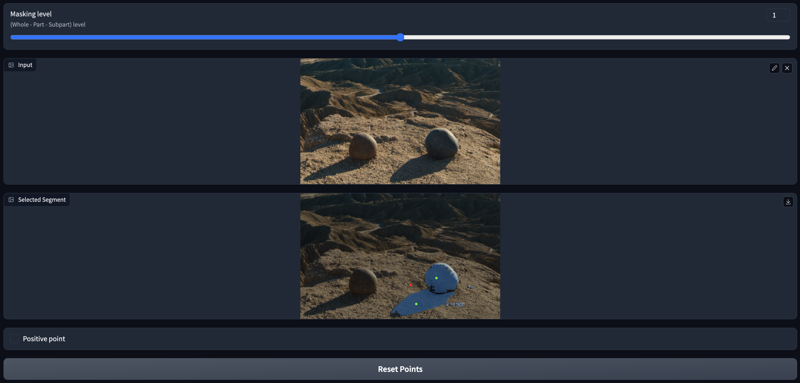

# Interactive SAM Demo with Gradio 交互式SAM

This is a demo application on Segment Anything Model with user point prompts. 

一个带有用户点击的Segment Anything Model的演示应用程序。



- Segment Anything Model ([SAM](https://github.com/facebookresearch/segment-anything)) is a segmentation foundation model recently released by Facebook Research, capable of segmenting literally anything in an image with remarkable accuracy. Its basic function is to segment objects indicated by user prompts such as points, boxes, and masks.

Segment Anything Model ([SAM](https://github.com/facebookresearch/segment-anything))是Facebook Research最近发布的一个分割基础模型，能够以惊人的精度分割图像中的任何东西。它的基本功能是分割由用户提示(如点、框和掩码)指示的对象。

- Gradio, a machine learning tool for building UIs, has recently added support for [getting image coordinates of mouse clicks](https://github.com/gradio-app/gradio/pull/3786), which is utilized in this application.
Gradio是一个用于构建UI的机器学习工具，最近增加了对[获取鼠标点击的图像坐标](https://github.com/gradio-app/gradio/pull/3786)的支持，在本应用程序中使用。

## Main functions 主要功能

- Give positive, negative points
- FP16 inference for faster inference

## Quick Start 快速开始

```bash
git clone https://github.com/jungletada/gradio_sam
cd gradio_sam
pip install -r requirements.txt

python3 main.py
```

## Acknowledgement

```
@article{kirillov2023segany,
  title={Segment Anything},
  author={Kirillov, Alexander and Mintun, Eric and Ravi, Nikhila and Mao, Hanzi and Rolland, Chloe and Gustafson, Laura and Xiao, Tete and Whitehead, Spencer and Berg, Alexander C. and Lo, Wan-Yen and Doll{\'a}r, Piotr and Girshick, Ross},
  journal={arXiv:2304.02643},
  year={2023}
}

@article{abid2019gradio,
  title = {Gradio: Hassle-Free Sharing and Testing of ML Models in the Wild},
  author = {Abid, Abubakar and Abdalla, Ali and Abid, Ali and Khan, Dawood and Alfozan, Abdulrahman and Zou, James},
  journal = {arXiv preprint arXiv:1906.02569},
  year = {2019},
}
```
